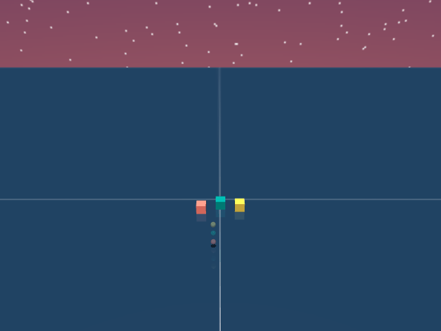
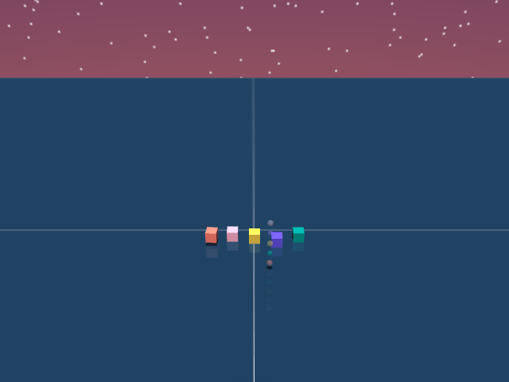

# Experiment Commands
All runs are trained for 200,000,000 timesteps.

Baseline CRL (Short horizon/PD controller)
```
python stable_crl.py --env_id creative-4-task1 --use_pd --pd_duration 5 --architecture default
```
StableCRL (Short horizon/PD controller)
```
python stable_crl.py --env_id creative-4-task1 --use_pd --pd_duration 5 --architecture default --repetition_factor 12 --entropy_cost 0.01 
```
StableCRL Scaled (Short horizon/PD controller)
```
python stable_crl.py --env_id creative-4-task1 --use_pd --pd_duration 5 --architecture block --num_blocks 8 --repetition_factor 12 --entropy_cost 0.01 
```

StableCRL Scaled (Long horizon/Raw controller)
```
python stable_crl.py --env_id creative-4-task1 --no-use_pd --architecture block --num_blocks 8 --repetition_factor 12 --entropy_cost 0.01 
```

PPO (Short horizon/PD controller)
```
python ppo_pd.py --env_id creative-4-task1 --use_pd --pd_duration 5
```

PPO (Long horizon/Raw controller)
```
python ppo_pd.py --env_id creative-4-task1 --no-use_pd
```

## DCC continual RL

This fork adds a Decomposed Contrastive Critic on top of StableCRL while
retaining the paper implementation's PD horizon reduction, trajectory
repetition, entropy regularization, and log-sum-exp regularization.

Single-task DCC smoke run:

```bash
python stable_crl_dcc.py \
  --env-id creative-2-task1 \
  --num-timesteps 1000000 \
  --num-envs 256 \
  --repetition-factor 12 \
  --entropy-cost 0.01 \
  --no-track \
  --no-record-videos \
  --no-visualize-samples \
  --mjx-impl jax
```

Use `--mjx-impl warp` (the default) for the paper's GPU path; `jax` is useful
for CPU initialization and correctness smoke tests.

Continual run (the default curriculum is pick/place followed by increasingly
long stacks):

```bash
python continual_dcc.py \
  --task-sequence creative-1-task1,creative-1-task2,creative-2-task1,creative-3-task1,creative-4-task1 \
  --base-steps 200000000 \
  --steps-per-task 200000000 \
  --repetition-factor 12 \
  --entropy-cost 0.01
```

Core SGCRL/DCC ablations are available directly, for example:

```bash
python continual_dcc.py \
  --dcc-combine-mode concat \
  --dcc-goal-encoder-mode shared \
  --dcc-task-width 256 \
  --dcc-task-depth 4
```

The DCC implementation intentionally has no dynamics head or dynamics loss.
Its actor, shared state-action encoder, and shared goal encoder use the same
flat residual architecture as the successful upstream StableCRL controls.

Changing an algorithmic setting requires a fresh boundary-checkpoint
directory. Resume checkpoints store and validate the full training recipe.

The continual driver writes an immutable task manifest, atomic task-boundary
checkpoints, seen-task and next-task evaluation rows in
`checkpoints/continual_dcc/continual_eval.jsonl`, and lightweight success
matrices to a dedicated resumable W&B evaluation run.

### Fixed semantics across tasks

Variable-cube inputs use a fixed-capacity semantic vector. Every cube keeps a
stable BuilderBench object slot, the previous continuous selector is converted
to a selected-object flag, and an explicit validity mask distinguishes real
cubes from padding. DCC consumes that vector with the proven upstream residual
MLPs. The shared state-action representation is combined with a fresh
task-specific residual adapter; the adapter starts at zero so additive DCC is
functionally identical to flat upstream StableCRL at initialization.

Task identities use a versioned hash of canonical goal geometry. The hash is
invariant to cube permutation and horizontal translation while preserving
height above the ground plane, so `pick` and `place` remain distinct skills.
Set `--max-cubes` to the largest task in the curriculum before training. A
larger capacity changes flat residual parameter shapes and therefore requires
a separate run or an explicit learned input adapter; it cannot be introduced
halfway through a checkpoint sequence.

## Implementation notes

- `docs/2026-08-21_stablecrl_upstream_audit.md` records provenance and the
  repository decision.
- `docs/2026-08-21_dcc_continual_implementation.md` records the DCC lifecycle,
  SGCRL parity, semantic layout, validation, and capacity recommendation.
- `docs/2026-08-21_documentation_convention.md` defines the required dated
  implementation-note convention.
- `docs/2026-08-21_torch_hpc_experiments.md` documents the Torch Slurm array,
  SGCRL-matched cells, environment setup, and checkpoint layout.
- `docs/2026-08-22_continual_crl_baselines_and_controls.md` documents the
  encoder design, vanilla reset/reset and persistent/persistent lifecycles,
  individual-task controls, and the baseline-first run order.
- `docs/2026-08-23_builderbench_environment_contracts.md` records every
  routed environment's observation/action/goal dimensions, horizons, rewards,
  and success definitions.
- `docs/2026-08-23_continual_and_meta_protocol.md` defines the diagnostic,
  continual, capacity-bucket, and future meta-learning protocols.
- `docs/2026-08-23_continual_eval_and_padding_controls.md` records the matrix
  logger, padding-only/upstream controls, staged configs, and validation.
- `docs/2026-08-23_residual_dcc_no_dynamics.md` records the diagnostic result,
  no-dynamics DCC redesign, repeated boundary evaluation, and new Torch gate.
- `docs/2026-08-23_dcc_smoke_hpc.md` records the dedicated residual-DCC smoke
  registry, short Torch launcher, acceptance criteria, and resume check.
- `docs/2026-08-23_smoke_preflight_fixes.md` records the first Torch preflight
  failures, the restored standalone vanilla set control, and launcher-test
  environment isolation.

## NYU Torch HPC

The registry contains 72 indices. Completed padding diagnostics are 36--53;
the residual no-dynamics DCC parity gate is 54--59; flat-CRL protocol controls
are 60--65; and DCC protocol cells are 66--71. Every group uses seeds 5/6/7.
`DRAFT.sh` defaults to `dcc_residual_gate`, so an unqualified six-slot array
runs only the required 3-block/4-block DCC parity check.

Run the dedicated three-cell GPU smoke gate before the 200M-step parity gate:

```bash
python smoke_experiment_configs.py --list
DRY_RUN=true CONFIG_INDEX=2 bash DRAFT_DCC_SMOKE.sh
sbatch --account=torch_pr_XXX_XXXXX DRAFT_DCC_SMOKE.sh
```

`DRAFT_DCC_SMOKE.sh` uses the production network dimensions but only
2,097,152 environment steps per task. Its first two cells exercise CRTR on
three- and four-cube tasks; its last cell exercises two-task transfer,
continual matrices, boundary checkpoints, and resume.

```bash
python experiment_configs.py --list
DRY_RUN=true CONFIG_INDEX=54 bash DRAFT.sh
my_slurm_accounts
EXPERIMENT_STAGE=dcc_residual_gate \
  sbatch --account=torch_pr_XXX_XXXXX --array=0-5 DRAFT.sh
# Only after the DCC parity gate passes:
EXPERIMENT_STAGE=protocol_baselines \
  sbatch --account=torch_pr_XXX_XXXXX --array=0-5 DRAFT.sh
EXPERIMENT_STAGE=protocol_dcc \
  sbatch --account=torch_pr_XXX_XXXXX --array=0-5 DRAFT.sh
# Or launch both protocol halves together:
EXPERIMENT_STAGE=protocol \
  sbatch --account=torch_pr_XXX_XXXXX --array=0-11 DRAFT.sh
```

Torch requires the allocation account and does not require a manually chosen
partition. `DRAFT.sh` defaults to one run per GPU and writes a separate
checkpoint directory for every configuration and seed.

## Demos

### Long Horizon (3 Stack)



### PD-5 (5 stack)



<!--1) For the creative cube mode, play around with action scales to make sure which values are best for RL.
2) Directly get mat from data.xmat or something instead of doing mjx.math.quat_to_mat.
3) Try reward normalization for ppo.-->
